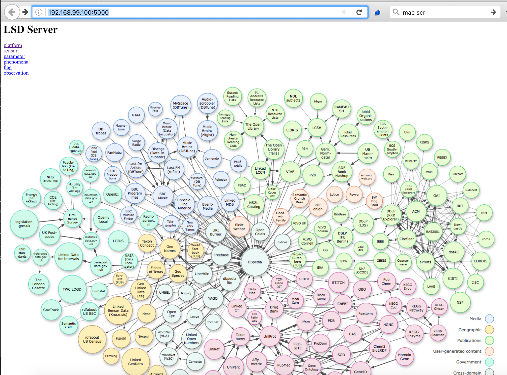

# lsdserver

## Linked Sensor Data Server

# Work In Progress -- not working yet!
Please get in touch if interested in contributing

[API -- UNSTABLE!](api.md)
[SQLAlchemy backend](backend_sqlalchemy.md)

# What does this do right now?
...Basically nothing.  I've wanted to work on this project but never get chance and there's always a bunch of things I need to do before I can work on this.

That said, I do now have (partial) Dockerfile to at least boot the flask application.  This needs to be improved to use docker compose to gain database support, etc.

Still, here's a cool screenshot of the main page just to prove this still even runs!

